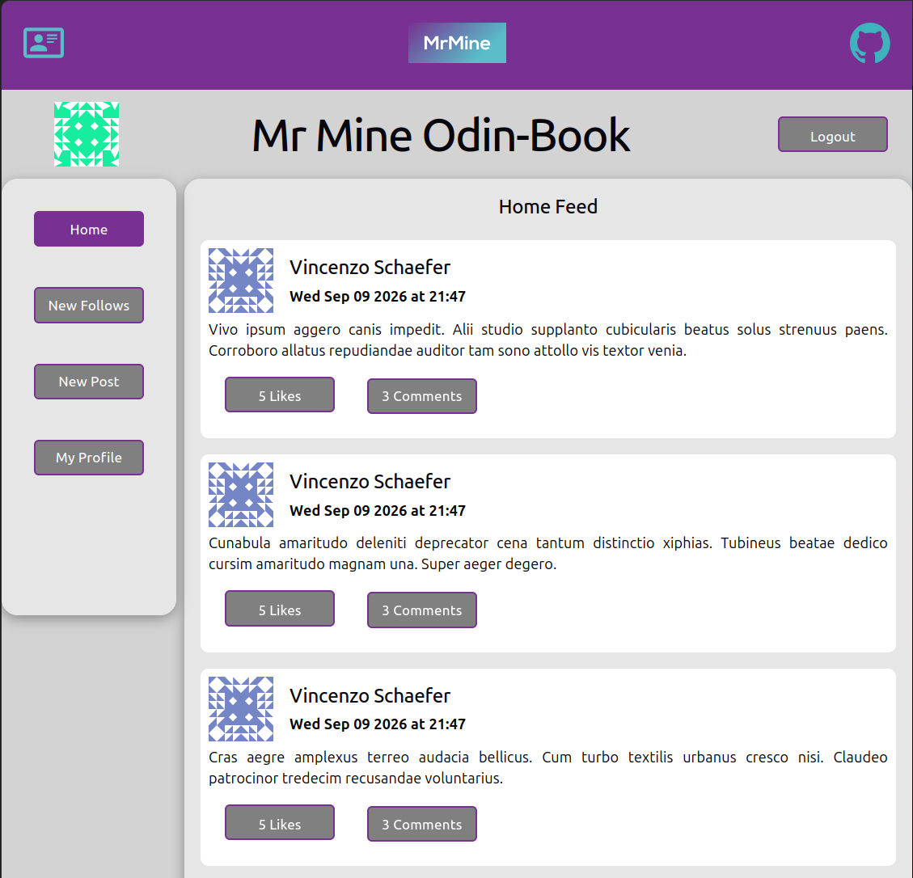
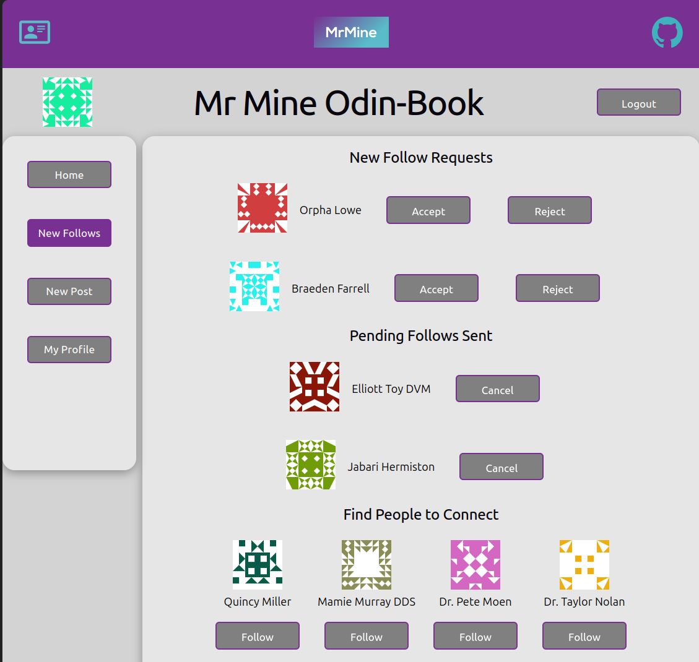

# Odin Book

A full-stack social networking application where users can publish posts, comment, like posts, and manage follow requests.

I built the React frontend and Express REST API as my final project for [The Odin Project](https://www.theodinproject.com/), bringing together frontend development, relational database modelling, authentication, testing, and deployment.

**[Live demo](https://mrmine-odin-book.netlify.app/)** · **[Backend repository](https://github.com/Michael-Mine/odin-book-api)**

Choose **Guest Login** to explore the app without creating an account.





## Features

- Browse a paginated home feed containing your posts and posts from users you follow.
- Create posts, write comments and like posts.
- Discover users and send follow requests.
- Accept, reject, and cancel follow requests, or unfollow users.
- View profiles, posts, followers, and following lists.
- Edit your profile about section.
- Display profile pictures through Gravatar, with generated fallback avatars.
- Sign up and log in using session-based authentication.

## Engineering Highlights

### Loading more posts without losing the current feed

The feed uses cursor-based pagination to load additional posts. New pages are appended to the existing feed, and the pagination control is disabled while a request is pending.

If a request fails, existing posts remain visible and the user can retry from the same cursor.

### Handling overlapping profile requests

Profile tabs load posts, followers, and following lists on demand and reuse previously fetched content.

Switching tabs cancels the previous request using `AbortController`. Response handling also checks which request is current, preventing an older response from overwriting the active tab’s content or loading state.

### Managing authentication across the frontend and API

The frontend checks the current session and protects routes that require authentication. Users who need to log in are returned to their originally requested page after authentication.

The API uses Passport Local, hashed passwords, and sessions stored in PostgreSQL. Frontend requests include credentials, with CORS and cookie settings configured for the separate frontend and backend deployments.

### Testing user-visible behaviour

The frontend has **423 automated tests across 43 test files**, covering components, custom hooks, routing, and user interactions.

Examples include:

- Successful login, rejected credentials, and redirects after authentication.
- Loading, empty, success, and error states.
- Pagination, failed requests, and retries.
- Preventing duplicate submissions while requests are pending.
- Request cancellation and stale responses.
- Follow-request actions and profile interactions.

Tests use Vitest and React Testing Library with mocked API requests. They verify frontend behaviour independently of a running backend; they are not browser end-to-end tests.

## Tech Stack

| Area           | Technologies                              |
| -------------- | ----------------------------------------- |
| Frontend       | React, JavaScript, React Router           |
| Styling        | CSS Modules and shared CSS                |
| Build tooling  | Vite                                      |
| Backend        | Node.js, Express                          |
| Database       | PostgreSQL, Prisma ORM                    |
| Authentication | Passport Local, express-session, bcryptjs |
| Validation     | express-validator                         |
| Testing        | Vitest, React Testing Library, jest-dom   |
| Deployment     | Netlify frontend, Railway backend         |

## Architecture

The application is maintained in two repositories:

- **This repository:** the React single-page application, organised into feature areas such as authentication, feed, posts, comments, likes, profiles, and follows.
- **[Backend repository](https://github.com/Michael-Mine/odin-book-api):** the Express API, authentication, validation, and database access.

The frontend communicates with the API through JSON requests under `/v1`. Prisma models users, posts, comments, likes, follow relationships, and sessions in PostgreSQL.

See the [backend README](https://github.com/Michael-Mine/odin-book-api#readme) for the database schema, API endpoints, and backend setup.

## Local Development

### Prerequisites

- Node.js 24 and npm.
- The backend API configured and running. Follow the setup instructions in the [backend repository](https://github.com/Michael-Mine/odin-book-api).

### 1. Clone and install

```bash
git clone https://github.com/Michael-Mine/odin-book-fe.git
cd odin-book-fe
npm ci
```

### 2. Configure the environment

Create a `.env` file in the project root:

```dotenv
VITE_API_URL=http://localhost:3003/
```

Keep the trailing `/`: the frontend appends paths such as `v1/auth/login` to this value.

To enable **Guest Login**, also add credentials for an existing demo account in your backend database:

```dotenv
VITE_GUEST_EMAIL=guest@example.com
VITE_GUEST_PASS=your-demo-account-password
```

These values do not create the account. Vite includes `VITE_` variables in the browser bundle, so use a dedicated public demo account.

Ensure the backend’s `FRONTEND_ORIGIN` matches the frontend development URL, normally `http://localhost:5173`.

### 3. Start the frontend

```bash
npm run dev
```

Open the local URL printed by Vite.

## Available Commands

| Command                 | Purpose                              |
| ----------------------- | ------------------------------------ |
| `npm run dev`           | Start the development server         |
| `npm run test`          | Run tests in watch mode              |
| `npm run test -- --run` | Run the test suite once              |
| `npm run lint`          | Run ESLint                           |
| `npm run build`         | Create the production build          |
| `npm run preview`       | Preview the production build locally |

## Deployment

The frontend is hosted on Netlify.

To deploy your own instance:

1. Connect the frontend GitHub repository to Netlify.
2. Set the build command to `npm run build`.
3. Set the publish directory to `dist`.
4. Set `VITE_API_URL` to your deployed API’s base URL, including the trailing `/`.
5. Set `VITE_GUEST_EMAIL` and `VITE_GUEST_PASS` if using guest login.
6. Configure the backend’s `FRONTEND_ORIGIN` to match your frontend URL.

The repository includes `public/_redirects` so direct visits to client-side routes are served through `index.html`.

## Current Limitations

- The feed does not update automatically; refresh the page to check for new posts.
- Automated tests cover the frontend with mocked API responses. Browser end-to-end testing against the backend is a future improvement.

## Acknowledgements

Built as the final project in [The Odin Project](https://www.theodinproject.com/) full-stack JavaScript curriculum.

Profile images are provided through [Gravatar](https://gravatar.com/).
